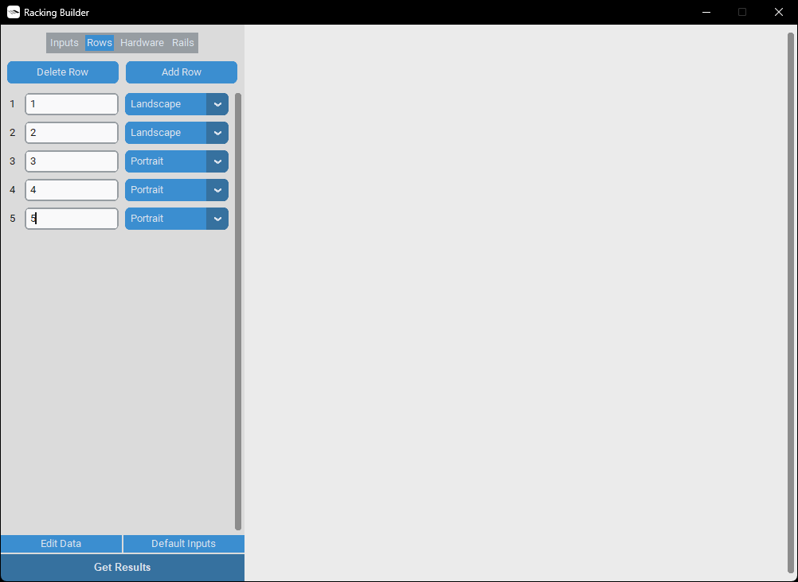
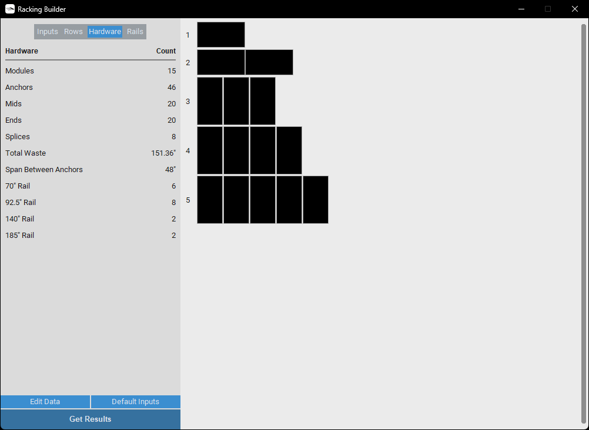

# Racking Builder

The **Racking Builder** is a desktop tool developed in Python 3.10.5 using the [CustomTkinter](https://github.com/TomSchimansky/CustomTkinter) UI library. This application helps solar system designers determine the required hardware and optimize rail selections for a defined flush-mounted rooftop solar array, minimizing material waste.

The tool allows users to:

- **Select or define a solar panel model:** Choose from a list of predefined solar panel models or manually enter custom specifications.
- **Configure parameters like panel spacing and rail geometry:** Adjust settings like panel spacing and racking geometry, which may vary based on manufacturer specifications or contractor methods.
- **Modify panel and rail data for a customized experience:** Update or add panel and rail information to customize the app.

## Basic Workflow

1. **Select Panel Model:** In the *Inputs* tab, choose a panel model from the dropdown under *Panel Specifications*.
2. **Configure Racking:** Adjust the racking specifications to match the installer's requirements.
3. **Define Rows:** Switch to the *Rows* tab to specify the number of panels and the orientation of each row in the array.
4. **Get Results:** Click *Get Results* at the bottom of the sidebar to view the hardware counts and update the preview pane. Afterward, you can switch to the *Rails* tab for a detailed breakdown of rail selections, cutoff lengths, and the deadload for each row.

## Inputs

### Panel Specifications

Input Label | Units | Type | Description
------------|-------|------|------------
**Panel model** | N/A | Dropdown | Select the solar panel model from a predefined list
**Panel width** | Inches | User-defined | Specify the width of the solar panel
**Panel height** | Inches | User-defined | Specify the height of the solar panel
**Panel weight** | Pounds | User-defined | Specify the weight of the solar panel

### Racking Specifications

Input Label | Units | Type | Description
------------|-------|------|------------
**Pattern** | N/A | Dropdown | Select the pattern of the mounting brackets: "Continuous" or "Staggered"
**Rafter spacing** | Inches | Dropdown | Choose the spacing between rafters, which affects the mounting bracket placement. The application 
**Panel spacing** | Inches | User-defined | Specify the space between adjacent solar panels in the array
**Bracket inset** | Inches | User-defined | Enter the distance from the edge of the row of panels to the first mounting bracket
**Rail protrusion** | Inches | User-defined | Define the length of rail that extends beyond the edge of the row of panels
**Portrait rail inset** | Inches | User-defined | Set the inset distance for the top and bottom rails from the short edge of the solar panels when they are mounted in portrait orientation
**Landscape rail inset** | Inches | User-defined | Set the inset distance for the side rails from the long edge of the solar panels when they are mounted in landscape orientation
**Truss structure** | Yes / No | Checkbox | Indicate whether the roof is a truss structure. If "Yes," the application calculates the deadload considering a weight distribution extending 1 meter beyond all edges of the mounting footprint

## User Interface

    
     
    Default Interface Displayed on Startup

    
     
    Defining the Array Rows

    
     
    Hardware Count Summary

    
     
    Detailed Breakdown of Row Information

    
     
    Editing Application Data

